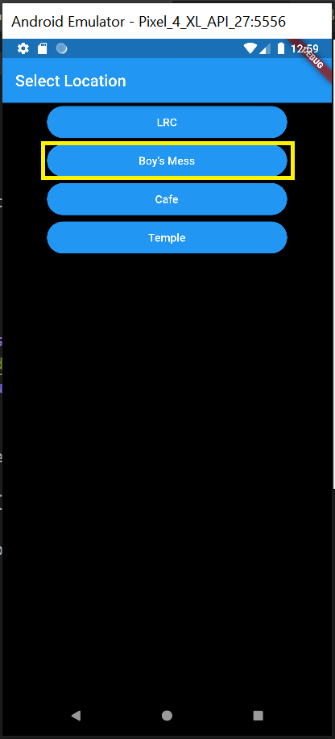
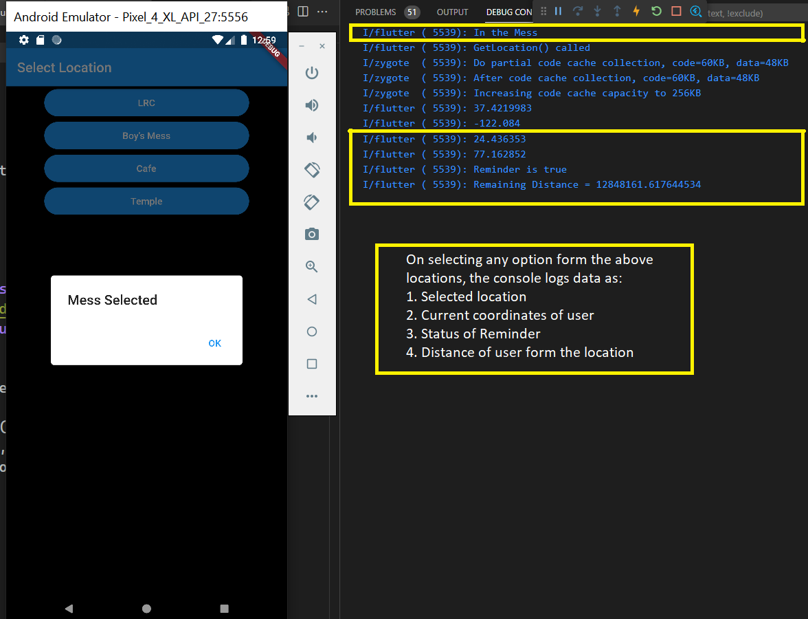
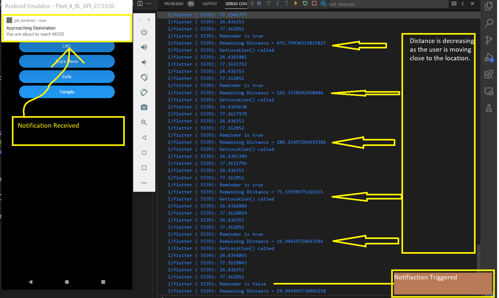

# GEO-REMINDER

**GEO-REMINDER** is a location-based task reminder application designed to help users remember tasks based on their geographical proximity rather than time constraints. By leveraging the user's current location, the application calculates the distance between the user and their selected destination to determine if a reminder should be triggered.

## Features

**-- Location-Based Reminders:** Instead of relying solely on time-based reminders, GEO-REMINDER allows users to set reminders based on their physical location. The application utilizes the user's current GPS coordinates to determine their proximity to a selected destination.

**-- Distance Calculation:** GEO-REMINDER employs advanced algorithms to calculate the distance between the user's current location and the specified destination. This enables precise location-based reminders that trigger when the user reaches a certain distance threshold.

**-- Task Management:** The application provides a user-friendly interface to manage tasks and reminders. Users can create, edit, and delete tasks, set their destination locations, and customize reminder settings.

## Technologies Used

**GPS and Location Services:** The application utilizes GPS and location services available on the user's device to determine their current coordinates and track their movement.

**Geocoding:** GEO-REMINDER employs geocoding services to convert addresses or place names into geographical coordinates, enabling the selection of specific destinations for reminders.

**Distance Calculation:** Advanced distance calculation algorithms, such as the Haversine formula, are used to accurately measure the distance between the user's location and the selected destination.

**User Interface:** The application features a user-friendly interface implemented using flutter.

## Screenshots

Watch the video to know the working better

